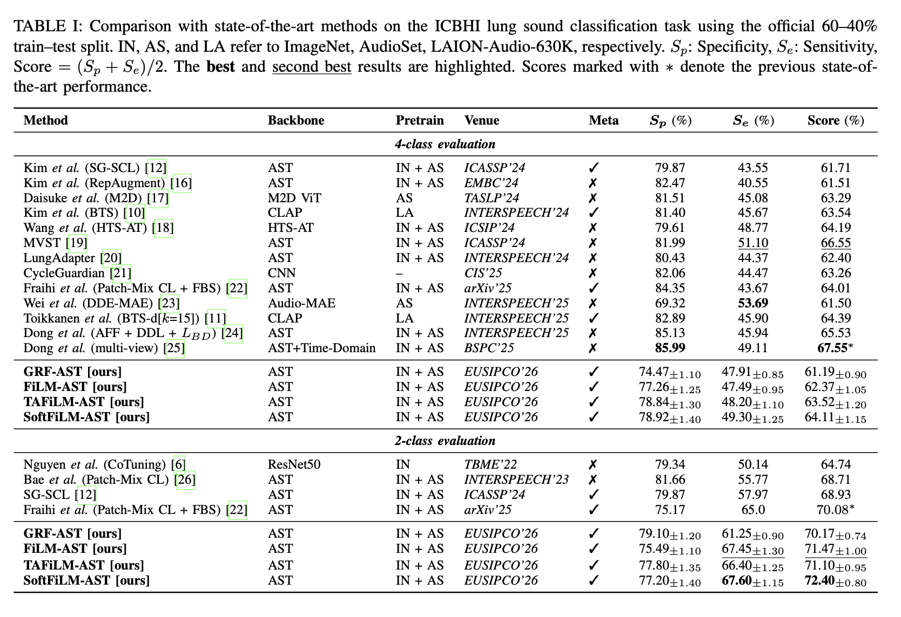

# Metadata-Conditioned Audio Transformers for Adaptive Respiratory Sound Classification

<p align="center">
  <b>Official Implementation</b> of <i>"Metadata-Conditioned Audio Transformers for Adaptive Respiratory Sound Classification"</i>
  <br>
  Submitted to <b>EUSIPCO 2026</b>
</p>

<p align="center">
  <a href="mailto:g.kontogiannis@ac.upatras.gr"><b>George Kontogiannis</b></a><sup>†</sup>, 
  <a href="mailto:tzamalis@ceid.upatras.gr"><b>Pantelis Tzamalis</b></a>, 
  <a href="mailto:nikole@ceid.upatras.gr"><b>Sotiris Nikoletseas</b></a>
  <br>
  <i>Computer Engineering and Informatics Department, University of Patras, Greece</i>
  <br>
  <sup>†</sup> Corresponding author
</p>

---

## Highlights

<!-- <p align="center">
  
</p> -->

**Family of metadata-conditioning mechanisms** for the Audio Spectrogram Transformer (AST), progressing from gated residual fusion to Feature-wise Linear Modulation (FiLM) adapted to the Transformer architecture.

Our proposed methods condition the Audio Spectrogram Transformer on recording metadata (device, auscultation site, patient demographics) through:

1. **Gated Residual Fusion (GRF)**: Projects metadata embeddings and adds to audio features with learnable gate
2. **FiLM**: Generates layer-wise scale (γ) and shift (β) parameters from metadata
3. **Token-Aware FiLM (TAFiLM)**: Applies distinct modulation to classification and patch tokens
4. **Soft-Factorized FiLM (SoftFiLM)**: Learns soft masks to align metadata factors (device, site, demographics) with disentangled feature subspaces

- **State-of-the-art on 2-class ICBHI** (72.40%) and **competitive performance on 4-class** (64.11%, +3.94% over baseline)

- **Interpretable disentanglement**: Learned soft masks partition the feature space with <3.2% pairwise overlap (vs. 33% expected by chance)

## Results

Comparison with state-of-the-art methods on the ICBHI lung sound classification task using the official 60-40% train-test split.

<p align="center">
  
</p>

---

## Installation
```bash
# Clone the repository
git clone https://github.com/gkontogiannhs/Metadata-Conditioned_Audio_Transformers.git
cd Metadata-Conditioned_Audio_Transformers

# Create conda environment
conda create -n icbhi-ast python=3.10
conda activate icbhi-ast

# Install PyTorch (adjust for your CUDA version)
pip install torch torchvision torchaudio

# Install the package
pip install -e .
```

This will install the `ls` package and all dependencies defined in `pyproject.toml`.

---

## 📁 Data Preparation

### 1. Download ICBHI Dataset

Download the ICBHI 2017 Respiratory Sound Database from the [official page](https://bhichallenge.med.auth.gr/ICBHI_2017_Challenge):

```bash
wget https://bhichallenge.med.auth.gr/sites/default/files/ICBHI_final_database/ICBHI_final_database.zip
unzip ICBHI_final_database.zip -d /path/to/icbhi_dataset
```

The dataset consists of 6,898 respiratory cycles from 126 subjects:
- 1,864 contain crackles
- 886 contain wheezes  
- 506 contain both
- 3,642 are normal

### 2. Generate Metadata File

Run the metadata creation notebook to generate the required CSV file:

```bash
jupyter notebook NBs/00-ICBHI_metadata_creation.ipynb
```

This creates `icbhi_metadata.csv` containing device, site, age, BMI, and duration for each cycle.

### 3. Update Configuration

Edit the config file to point to your data location:

```yaml
# configs/ast_config.yaml
dataset:
  name: icbhi
  data_folder: /path/to/icbhi_dataset
  cycle_metadata_path: /path/to/icbhi_dataset/icbhi_metadata.csv
  class_split: lungsound
  split_strategy: official  # official 60/40 split
  n_cls: 4                  # 4-class or 2-class
  batch_size: 16
  h: 128
  w: 1024
```

---

## Configuration

All hyperparameters are defined in YAML config files. Key settings:

```yaml
# Model configuration
models:
  ast_softfilm:
    label_dim: 2
    input_fdim: 128
    input_tdim: 1024
    dev_embed_dim: 8        # Device embedding dimension
    site_embed_dim: 8       # Site embedding dimension
    rest_dim: 3             # Continuous features (age, BMI, duration)
    film_hidden_dim: 64     # FiLM encoder hidden dimension
    conditioned_layers: [0, 1, 2, 3, 4, 5, 6, 7, 8, 9, 10, 11]  # All layers
    dropout: 0.4
    mask_init_scale: 2.0    # Soft mask initialization scale
    mask_overlap_lambda: 0.01  # Overlap regularization weight

# Training configuration
training:
  epochs: 100
  lr: 3e-5
  warmup_epochs: 10
  weight_decay: 0.01
  sensitivity_bias: 1.5
```

---

## Training

### Baseline AST (no metadata)

```bash
python ast_train.py \
    --config configs/ast_config.yaml \
    --mlflow-config configs/mlflow.yaml
```

### Gated Residual Fusion (GRF-AST)

```bash
python ast_meta_fus_train.py \
    --config configs/ast_fus_config.yaml \
    --mlflow-config configs/mlflow.yaml
```

### FiLM-AST

```bash
python ast_film_train.py \
    --config configs/ast_film_config.yaml \
    --mlflow-config configs/mlflow.yaml
```

### TAFiLM-AST

```bash
python ast_tafilm_train.py \
    --config configs/ast_tafilm_config.yaml \
    --mlflow-config configs/mlflow.yaml
```

### SoftFiLM-AST

```bash
python ast_film_soft.py \
    --config configs/ast_film_soft_config.yaml \
    --mlflow-config configs/mlflow.yaml
```

## Evaluation and Visualization

Generate performance results and analysis figures:

```bash
# Single figures
python visualize.py --config configs/best_params_config.yaml --mask-analysis --checkpoint checkpoints/softfilm_best.pt
python visualize.py --config configs/best_params_config.yaml --tsne --baseline-ckpt checkpoints/ast_best.pt --softfilm-ckpt checkpoints/softfilm_best.pt
python visualize.py --config configs/best_params_config.yaml --film-params --checkpoint checkpoints/softfilm_best.pt

# Multiple at once
python visualize.py --config configs/best_params_config.yaml --mask-analysis --film-params --checkpoint checkpoints/softfilm_best.pt

# All figures
python visualize.py --config configs/best_params_config.yaml --all --baseline-ckpt checkpoints/ast_best.pt --softfilm-ckpt checkpoints/softfilm_best.pt
```
